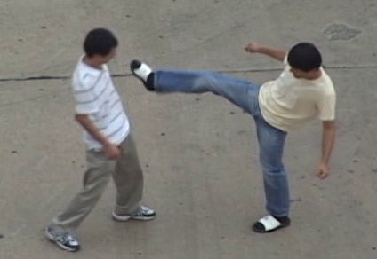
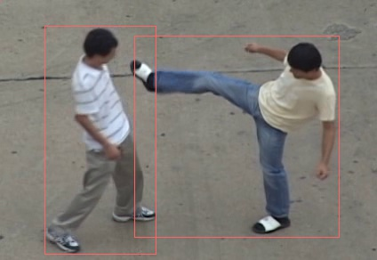

# object_detection_ssd
Single Shot Multibox Detector(SSD) is a regression based object detector. It's trained end to end on ground truth bounding box values. It directly predicts the offsets and class score for object beginning from default bounding boxes. Unlike YOLO, SSD uses multiple scale feature map to detect objects at multiple scale and aspect ratio. The feature extraction network is VGG-16 network. 

.

The frozen model graph has been downloaded from Tensorflow Model Zoo at the following link

https://github.com/tensorflow/models/blob/master/research/object_detection/g3doc/detection_model_zoo.md

Humans performing different actions have been detected from scenic images taken from the UT-Interaction dataset available at the following link.

http://cvrc.ece.utexas.edu/SDHA2010/Human_Interaction.html

.

Non-Maximum Suppression has also been applied after detecting to suppress the extra bounding boxes.

.
